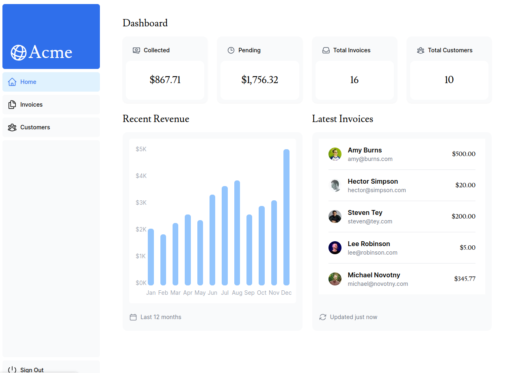

## Next.js App Router Course - Starter

This is the starter template for the Next.js App Router Course. It contains the starting code for the dashboard application.

    This is the oficial course about Next.js version 14, I study this course to improve my knowledge about Next js and to undestand the new features of Next 14.

## Course menu

1. [Capítulo 1 - Começando](/learn/dashboard-app/getting-started)
2. [Capítulo 2 - Estilização CSS](/learn/dashboard-app/css-styling)
3. [Capítulo 3 - Otimizando Fontes e Imagens](/learn/dashboard-app/optimizing-fonts-images)
4. [Capítulo 4 - Criando Layouts e Páginas](/learn/dashboard-app/creating-layouts-and-pages)
5. [Capítulo 5 - Navegando Entre Páginas](/learn/dashboard-app/navigating-between-pages)
6. [Capítulo 6 - Configurando Seu Banco de Dados](/learn/dashboard-app/setting-up-your-database)
7. [Capítulo 7 - Obtendo Dados](/learn/dashboard-app/fetching-data)
8. [Capítulo 8 - Renderização Estática e Dinâmica](/learn/dashboard-app/static-and-dynamic-rendering)
9. [Capítulo 9 - Streaming](/learn/dashboard-app/streaming)
10. [Capítulo 10 - Pré-renderização Parcial (Opcional)](/learn/dashboard-app/partial-prerendering)
11. [Capítulo 11 - Adicionando Busca e Paginação](/learn/dashboard-app/adding-search-and-pagination)
12. [Capítulo 12 - Mutando Dados](/learn/dashboard-app/mutating-data)
13. [Capítulo 13 - Lidando com Erros](/learn/dashboard-app/error-handling)
14. [Capítulo 14 - Melhorando a Acessibilidade](/learn/dashboard-app/improving-accessibility)
15. [Capítulo 15 - Adicionando Autenticação](/learn/dashboard-app/adding-authentication)
16. [Capítulo 16 - Adicionando Metadados](/learn/dashboard-app/adding-metadata)

## References

For more information, see the [course curriculum](https://nextjs.org/learn) on the Next.js Website.
